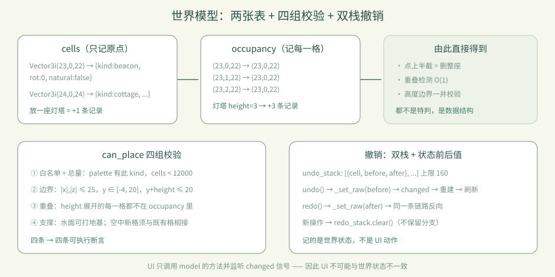

# 卷 1 · 第 06 章　世界模型：格子、高度、占位与撤销

> **本章目标**：理解《雾港》为什么能"放了就能撤销、高处不能悬空"——
> 全部答案都在 `project/scripts/world_model.gd` 的数据结构里。
>
> 对应任务：T16 / T17　|　对应文件：`project/scripts/world_model.gd`

---

## 6.1 世界就是两个字典

```gdscript
var cells: Dictionary = {}       # Vector3i -> {"kind":String,"rot":int,"natural":bool}
var occupancy: Dictionary = {}   # Vector3i(被占用的格) -> Vector3i(它属于哪个原点)
```

- `cells` 只记录**原点格**（模型的左下后角）
- `occupancy` 记录**模型占住的每一格**（含上方的格），值指向它的原点

为什么要两份？因为两个问题回答起来都必须是 O(1)：
**"这一格放了什么？"**（`occupancy` 反查 `cells`）与 **"这个模型占了哪些格？"**（按高度展开）。



**高度**：每种建材在 `palette.json` 里声明 `height`（占几格）。灯塔 3 格、树/灯/风车 2 格、其余 1 格。
所以删除"灯塔的上半截"，整座灯塔都会消失——这是 `occupancy → cells` 的直接后果，也是一条测试断言。

---

## 6.2 放置规则：四组校验

```gdscript
func can_place(cell, kind) -> bool:
    if not palette.has(kind) or cells.size() >= MAX_CELLS: return false   # ① 白名单 + 总量
    if not in_bounds(cell, height): return false                          # ② 边界（±25 / y -4..20）
    for dy in height:
        if occupancy.has(cell + dy): return false                          # ③ 重叠
    # ④ 支撑：水面可直接打地基；空中的新格必须与既有格相接
```

| 规则 | 常量/来源 | 对应断言 |
|---|---|---|
| 建材必须存在、总量不超 | `palette` / `MAX_CELLS=12000` | "unknown material rejected" |
| 边界 | `EDGE=25` `MIN_Y=-4` `MAX_Y=20` | "world bounds enforced" / "height bounds enforced" |
| 重叠 | `occupancy` | "cannot intersect tall model" |
| 支撑 | 邻接检查 | "unsupported midair cell rejected" |

> 📌 这四条不是"游戏感觉"，是**四条可执行断言**。改任何一条，测试会立刻告诉你。

---

## 6.3 撤销：命令模式 + 双栈

每次成功操作都记一条"命令"：

```gdscript
undo_stack.append({"cell": cell, "before": before, "after": after.duplicate()})
```

- `undo()`：把 `cell` 恢复成 `before`，弹入 `redo_stack`
- `redo()`：反向重放
- **新操作会清空 `redo_stack`**（这是刻意设计：分支历史不保留）
- 上限 `MAX_HISTORY = 160`，超出从队首丢弃

**为什么撤销是"数据问题"而不是"UI 问题"？** 因为 UI 只负责调用 `model.undo()`；
真正的状态在 `cells/occupancy` 里，UI 通过 `changed` 信号被动刷新。**任何 UI 都不可能和世界状态不一致**——
这就是本实训敢把撤销写进断言的原因。

---

## 6.4 一条完整的链路（放下一间小屋）

```
玩家点击 → main.gd 计算目标格 → model.place(cell, "cottage", rot)
        → can_place 四组校验 → _set_raw 写 cells/occupancy → _touch()
        → changed 信号 → build_world 重建网格 → UI 刷新计数
```

**撤销时走同一条路的反向**：`undo()` → `_set_raw(before)` → `changed` → 重建 → 刷新。
没有"特判的 UI 回滚"。

---

## 6.5 常见坑速查（本章）

| 现象 | 原因 | 处理 |
|---|---|---|
| 删上半截导致整座消失 | 多格模型由 `occupancy` 统一管理 | 这是**正确行为**，见断言 |
| 撤销后 UI 不刷新 | 没触发 `changed` 信号 | 所有写操作都要走 `_set_raw`/`_touch` |
| 空中放不下 | 支撑规则 | 先连到既有格，或从水面起地基 |
| 撤销步数不够 | `MAX_HISTORY=160` | 调整常量并同步测试断言 |
| 加了高建材却穿模 | `palette.height` 没同步 | 改 palette 后重跑测试 |

---

## 6.6 本章作业

1. 画出 `cells` 与 `occupancy` 的关系图（放一座 3 格灯塔后，两张表里各有几条记录？）
2. 为"新操作会清空重做分支"写一条断言并跑通
3. 把灯塔的 `height` 从 3 改成 4，跑测试，观察哪些断言报警（然后改回）
4. 回答：为什么删除"灯塔上半截"要整座消失？

---

## 🎓 教学提示（给教师 / 直播主）

- **概念锚点**：**先有数据结构，再有玩法**。撤销/重叠/支撑都是数据结构的副产品。
- **课堂演示**：现场改 `palette.json` 里灯塔的 `height`，跑测试看哪些断言红——
  这是讲"数据驱动 + 断言保护"最直观的演示。
- **高频误解**：学生以为撤销是"记住 UI 操作"。强调它记的是**世界状态的前后值**。
- **进阶讨论**：为什么 `redo_stack` 要清空？（保留分支会让状态机复杂化，且用户心智负担大）
- **批改要点**：作业 1 必须算对数量（灯塔：cells +1，occupancy +3）。

---

## 📹 录屏分镜（10 分钟）

| 时间 | 画面 | 解说词要点 |
|---|---|---|
| 00:00–01:30 | 两个字典的代码 + 示意图 | "世界就是两张表。" |
| 01:30–03:30 | 放灯塔，逐格 occupancy 高亮 | "高模型占多格，删一格整座没。" |
| 03:30–05:30 | 四组校验代码逐段 + 断言名 | "每条规则都有断言守着。" |
| 05:30–07:30 | 撤销/重做演示（含新操作清分支） | "撤销记的是状态，不是动作。" |
| 07:30–09:00 | 现场改 height 看测试变红 | "数据一改，断言立刻告诉你。" |
| 09:00–10:00 | 作业 + 预告（数据驱动三张表） | |

## 🖼 配图清单

| 文件名 | 内容 | 生成方式 |
|---|---|---|
| `06-start.png` | 起始画面 | `python tools/course_capture.py --chapter 06` |
| `06-beacon-placed.png` | 放下灯塔（3 格高度） | 同上 |
| `06-undo.png` | Ctrl+Z 之后（灯塔消失） | 同上 |

## 🎥 直播脚本（L3 片段，15 分钟）

- **挑战开场**："我故意在世界模型里埋了一个 bug，看谁能先找到"——现场演示撤销不刷新 UI
- **演示**：修掉（缺 `changed` 信号），讲"数据驱动 UI"
- **互动**：让观众猜改 `height` 会让几条断言变红
- **收尾**：布置作业 3（改 height 观察报警）

## ❓ 本章 FAQ

**Q：为什么不用数组/八叉树而用字典？**
A：世界是稀疏的（大部分格子是空的），字典按坐标直接命中，O(1) 且实现简单；
12000 上限下内存与性能都够。

**Q：撤销栈为什么是 160？**
A：产品权衡——足够覆盖一次建造会话的操作量，又不至于无限增长。它是常量，可按需调整。

**Q：多格模型的旋转会影响占位吗？**
A：占位按高度（Y 轴）展开，旋转只影响朝向，不影响占格数量。
