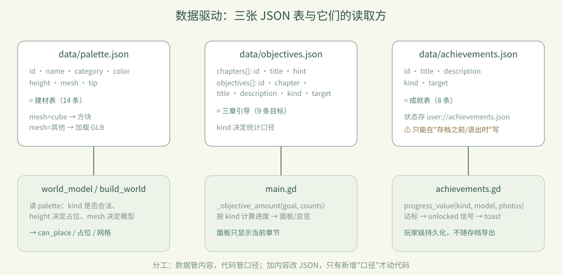

# 卷 1 · 第 07 章　数据驱动：三张 JSON 表撑起全部内容

> **本章目标**：掌握 `palette` / `objectives` / `achievements` 三张表的字段与扩展方式——
> 从此**加内容不用改代码**，只改 JSON（外加一条命令）。
>
> 对应任务：T21 / T22　|　对应文件：`project/data/*.json`

---

## 7.1 为什么要数据驱动

对比两种加法：

| | 硬编码 | 数据驱动（本实训） |
|---|---|---|
| 加一件建材 | 改 GDScript 数组、改 UI 分支、改图标 switch | 加一条 JSON + 跑一条命令 |
| 加一个目标 | 改 UI 列表、改统计逻辑 | 加一条 JSON（若 `kind` 已有统计口径） |
| 加一项成就 | 写代码判断 + 存状态 | 加一条 JSON（若 `kind` 已有统计口径） |

**代价**：统计口径（`kind` 的含义）仍写在代码里（`main.gd` 的 `_objective_amount`、
`achievements.gd` 的 `progress_value`）。所以新增"全新口径"时才需要动代码——
这是有意的分工：**数据管内容，代码管口径**。



---

## 7.2 palette.json：建材表

```json
{"id":"barrel","name":"木桶","category":"建筑","color":"b07d4f",
 "height":1,"mesh":"barrel","tip":"码头边的橡木桶，可以一只只堆起来。"}
```

| 字段 | 含义 | 注意 |
|---|---|---|
| `id` | 唯一键 | 同时是 `mesh` 默认名与 GLB 文件名 |
| `name` | 中文名 | **改中文后要跑字体工具**（T28） |
| `category` | 地形 / 建筑 / 自然 | 决定它出现在哪个分类页 |
| `color` | UI 色块（6 位 hex，不带 #） | 用于手绘图标与选中态 |
| `height` | 占几格 | 影响放置校验与撤销；改了要重跑测试 |
| `mesh` | `"cube"` = 用方块；其他 = 加载 `assets/models/<mesh>.glb` | 决定会不会进 GLB 缩略图流程 |
| `tip` | 选中时底部提示 | 同样是中文，受字体子集影响 |

**加一件建材的完整流程**（四步，零 GDScript 改动）：

```
1. 写建模脚本     tools/art/xxx.py
2. 跑管线         python tools/asset_pipeline.py build --id xxx --name 名字 --category 建筑
3. 自动完成       GLB → manifest → Godot 导入 → 写入 palette（保留原位、只覆盖传参的字段）
4. 验证           python tools/dev.py test
```

> 图标不用管：`model_thumbnail.gd` 会在运行时渲染 GLB 当图标。

---

## 7.3 objectives.json：章节与目标（schema_version 2）

```json
{"chapters":[{"id":1,"title":"第一章 · 落脚","hint":"熟悉放置、撤销与保存..."}],
 "objectives":[{"id":"boardwalk","chapter":1,"title":"延伸一段木栈道",
                "description":"亲手放置 8 块木栈道","kind":"wood","target":8}]}
```

**`kind` 就是统计口径**，目前有这些：

| kind | 含义 |
|---|---|
| `"wood"` / `"cottage"` / `"arch"` / `"beacon"` … | 该类建材的玩家放置数 |
| `"garden"` | `min(3, tree) + min(3, flower)` |
| `"journal"` | `min(1, 保存次数) + min(1, 撤销次数)` |
| `"variety"` | 用过的不同建材种类数 |
| `"total"` | 玩家放置总数 |
| `"night_photo"` | 夜景截图次数 |

新增目标时：有现成 `kind` → 只加 JSON；需要新口径 → 在 `main.gd` 的 `_objective_amount`
里加一个分支，并补一条断言。

**面板只显示当前章节**（2–4 条），完整进度在「目标与成就」——这是刻意的密度控制（见第 08 章）。

---

## 7.4 achievements.json：成就表

```json
{"id":"night_owl","title":"夜观察者","description":"在夜色中拍下一张照片",
 "kind":"night_photo","target":1}
```

与目标的差别只有两点：

1. **持久化位置不同**：成就存 `user://achievements.json`，**属于玩家，不属于作品**，
   不随存档槽导出；目标进度则来自当前世界状态
2. **落盘时机有讲究**：见下方"Web 写盘顺序"这个真实事故

> ⚠️ **真实事故（必读）**：Web 端 `user://` 是异步写入 IndexedDB 的。
> 本实训曾出现"成就文件在存档之后写，导致整份存档丢失"。
> 现在的规则是：**成就只在"存档之前"和"退出时"落盘**（`main.gd` 里 `achievements.flush()`
> 在 `model.save_slot()` 之前调用），绝不在自己的定时器里写。

---

### 🌩 在云端 agent（web-cb）里是什么样

| | 🖥 本地路线 | 🌩 云端 agent（web-cb） |
|---|---|---|
| 改 JSON | 改文件后跑 `dev.py test` | 一样的操作；平台可能提供**校验预览**（JSON schema / 断言提示） |
| 加建材 | 自己跑 `asset_pipeline.py build` | 同一条命令，产物落在平台工作区 |
| 持久化差异 | 写本地磁盘，行为可预测 | 云端预览环境同样是 Web 运行时，**IndexedDB 写盘顺序的坑完全一样存在** |
| 排错 | 本地复现 | 先用 `dev.py test` 排除逻辑，再查运行时（写盘/预览） |

> 🌩 提醒：不要因为"在云端"就以为没有 Web 运行时的坑——
> 云端预览往往**正是 Web 导出**，第 7.4 的写盘顺序问题在那里同样会发生。

---

## 7.5 常见坑速查（本章）

| 现象 | 原因 | 处理 |
|---|---|---|
| 加了建材但游戏里没有 | 只改了 JSON，没放 GLB | 跑 `asset_pipeline.py build` |
| 改中文后出现方框 | 子集字体缺字 | 跑 `build_font_corpus.py` |
| 改 `height` 后穿模/测试红 | 占位与断言不一致 | 改完必跑测试 |
| 面板顺序变了 | 注册逻辑曾把条目移到分类末尾 | 现状：已存在条目**保留原位** |
| Web 上存档丢失 | 第二个文件在存档之后写 | 见 7.4：把其他写盘放在存档之前 |

---

## 7.6 本章作业

1. 加一件"新分类外"的建材：写脚本 → 跑管线 → 跑测试（可先从复制 `barrel.py` 改名开始）
2. 给第三章加一条目标（用现成 `kind`，例如 `total: 80`），跑测试确认面板显示变化
3. 加一项成就（用现成 `kind`），并**验证它只解锁一次**（重进不重复弹）
4. 回答：目标进度与成就状态分别存在哪里？为什么这么分？

---

## 🎓 教学提示（给教师 / 直播主）

- **概念锚点**：**数据管内容，代码管口径**。这条边界讲清了，学生就不会乱改代码。
- **课堂演示**：现场加一条目标（`total: 80`），刷新看面板变化——30 秒见效，很有说服力。
- **高频误解**：学生以为"数据驱动 = 什么都不用改代码"。用 `kind` 的例子说明边界在哪。
- **压轴案例**：7.4 的"Web 写盘顺序导致丢存档"——这是本实训最有教学价值的真实事故，
  建议整段讲（它同时涉及运行时、持久化、验证三条线）。
- **批改要点**：作业 4 必须答出"成就属于玩家、目标属于作品"。

---

## 📹 录屏分镜（9 分钟）

| 时间 | 画面 | 解说词要点 |
|---|---|---|
| 00:00–01:20 | 硬编码 vs 数据驱动 对比 | "加内容不该改代码。" |
| 01:20–03:00 | palette 字段表 + 加建材四步 | "一条命令，从脚本到可放置。" |
| 03:00–04:40 | objectives 的 kind 口径表 | "数据管内容，代码管口径。" |
| 04:40–06:20 | **Web 写盘顺序事故**复盘 | "存档之后再写别的文件，存档会丢。" |
| 06:20–08:00 | 现场加一条目标看面板变化 | "30 秒见效，这就是数据驱动的价值。" |
| 08:00–09:00 | 作业 + 预告（观感设计） | |

## 🖼 配图清单

| 文件名 | 内容 | 生成方式 |
|---|---|---|
| `07-dock-building.png` | 建筑分类建材栏全貌（数据渲染结果） | `python tools/course_capture.py --chapter 07` |
| `07-progress-panel.png` | 目标与成就面板 | 同上 |
| `07-place-tree.png` | 放置一棵树（触发目标统计） | 同上 |

## 🎥 直播脚本（L5 片段，12 分钟）

- **开场投票**："加一件建材，你觉得要改几个文件？"（多数人会高估）
- **演示**：现场四步加一件建材 + 现场加一条目标
- **事故复盘**：7.4 的写盘顺序（可用"先存档 vs 先写成就"两版对比演示）
- **收尾**：强调"数据驱动也有边界"

## ❓ 本章 FAQ

**Q：能不能再加一个分类（比如"装饰"）？**
A：可以，但要同步 UI：`main.gd` 里分类按钮是硬编码的三个。这是本实训明确的"代码侧"边界。

**Q：成就能不能按作品存档？**
A：现状是按玩家存（`user://achievements.json`）。若要按作品，需要改存储位置与导出逻辑。

**Q：objectives 的 schema_version 从 1 升到 2，旧存档会坏吗？**
A：不会——`schema_version` 是**存档格式**的版本，与 `objectives.json` 的字段无关；
但课件若沿用旧格式，`chapters` 缺失时面板会退化（这也是要跑测试的原因）。
