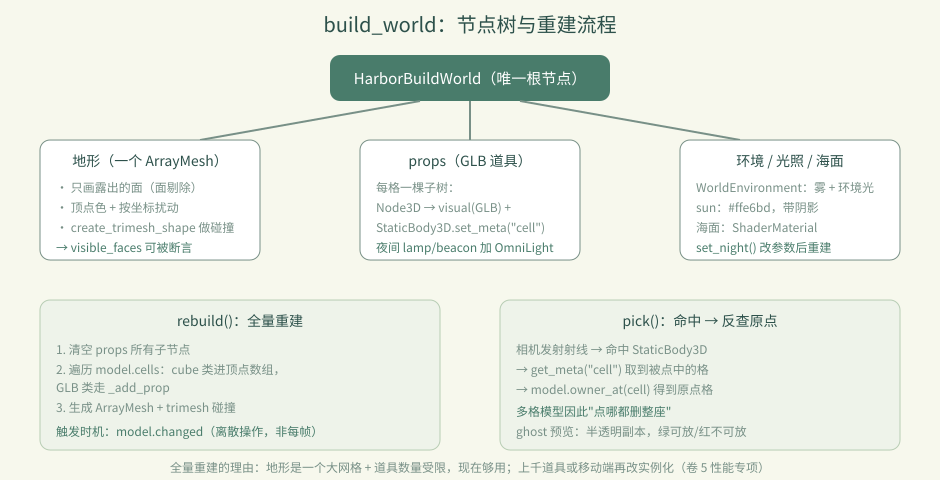

# 卷 2 · 第 10 章　build_world：一格数据怎么变成一座岛

> **本章目标**：读通 `build_world.gd`——地形网格怎么生成（为什么只画露出的面）、
> 道具（GLB）怎么摆、点击怎么命中、昼夜怎么切换。
>
> 对应任务：T16 / T39　|　对应文件：`project/scripts/build_world.gd`

---

## 10.1 节点树：一堆 Node 拼出来的舞台

```
HarborBuildWorld (Node3D)
├─ WorldEnvironment       环境：雾、背景色、环境光
├─ DirectionalLight3D     sun：暖阳 #ffe6bd，带阴影
├─ MeshInstance3D         terrain：地形网格（动态生成）
│  └─ StaticBody3D        地面碰撞（trimesh）
├─ Node3D                 props：所有 GLB 道具
├─ Node3D                 ghost：放置预览（半透明）
└─ 海面 MeshInstance3D    sea_material（ShaderMaterial）
```

**注意**：这些节点**全部是代码 `new()` 出来的**，`main.tscn` 里只有一个根节点。
好处是"世界状态"和"场景结构"完全由数据驱动；代价是必须理解 `rebuild()`。



---

## 10.2 地形：只画"露出来的面"

```gdscript
for face in FACES:
    var neighbor = model.get_cell(cell + face.offset)
    if not neighbor.is_empty() and neighbor 的 mesh == "cube":
        continue           # 被同类方块挡住 → 这一面不画
    visible_faces += 1
    ...
```

| 关键点 | 说明 |
|---|---|
| **面剔除** | 相邻格也是 cube 类，这一面不可见 → 跳过。省掉大量三角形 |
| `visible_faces` | 实际渲染的面数，**测试会断言它 > 0**（证明地形真的生成了） |
| 顶点色 | `color` 写进顶点，材质 `vertex_color_use_as_albedo = true` |
| 颜色扰动 | 按坐标 hash 出 ±0.07 的亮度变化，避免大片死板同色 |
| 特殊着色 | 草的侧面、水下的石头有专门颜色，让地形有层次 |

> 📌 这是典型的"**数据 → 顶点数组 → ArrayMesh**"流程：
> `PackedVector3Array` + `PackedColorArray` → `add_surface_from_arrays` → `ArrayMesh`。

---

## 10.3 碰撞：从同一个网格生成

```gdscript
var shape := mesh.create_trimesh_shape()
shape.backface_collision = true
ground_collision.shape = shape
```

**一份网格，两种用途**（渲染 + 拾取）。`backface_collision = true` 是为了从内侧也能命中，
避免相机穿到地形下方时拾取失效。

---

## 10.4 道具（GLB）：一个格子一棵子树

```gdscript
func _add_prop(cell, item) -> void:
    var root := Node3D.new()
    root.position = Vector3(cell) + Vector3(0.5, 0, 0.5)   # 格子中心
    var visual := _visual(kind)                            # 实例化 GLB 场景
    visual.rotation.y = item.rot * PI / 2.0                 # 朝向
    var body := StaticBody3D.new()
    body.set_meta("cell", cell)                            # ← 拾取靠它
```

**`set_meta("cell", cell)` 是这一章最关键的细节**：
射线命中的是 `StaticBody3D`，但它需要告诉调用方"你点到了哪个格子"——
于是把坐标存在 meta 里。这样拾取逻辑和渲染逻辑彻底解耦。

---

## 10.5 拾取：射线 → meta → 原点格

```gdscript
func pick(camera, screen_position) -> Dictionary:
    # 从相机发射射线，命中 body
    # 读 body.get_meta("cell")
    # 用 model.owner_at(cell) 反查原点格（多格模型的关键！）
```

返回给 `main.gd` 的是**原点格**（不是被点到的那一格）——这就是第 06 章
"点灯塔上半截会删掉整座"的实现落点。

---

## 10.6 预览与昼夜

| 机制 | 实现 |
|---|---|
| ghost 预览 | `show_ghost()` 实例化一个半透明副本，绿=可放、红=不可放，跟随鼠标 |
| 昼夜 | `set_night()` 改 `environment` 的背景/环境光/雾色、`sun` 的颜色与强度、海面 shader 参数；再 `needs_rebuild = true` |
| 夜间灯光 | `lamp` / `beacon` 在夜间额外挂 `OmniLight3D`（暖橙 `#ffbd70`） |

---

## 10.7 性能：为什么"全量重建"现在够用

`rebuild()` 每次都**清空 props 重建整棵树**，听起来很浪费，但在本实训的规模下：

- 地形是**一个** ArrayMesh（不是每格一个 MeshInstance）→ Draw Call 极少
- 道具数量受 `MAX_CELLS=12000` 限制，且多数是低模
- 重建只在 `model.changed` 后触发（离散操作，不是每帧）

**什么时候要改**：道具数量上千、或要支持移动端低端机时，就该考虑
**实例化（MultiMesh / 分块）** 与 **增量重建**。这属于卷 5 的性能专项。

---

### 🌩 在云端 agent（web-cb）里是什么样

| | 🖥 本地路线 | 🌩 云端 agent（web-cb） |
|---|---|---|
| 渲染后端 | 本地 GPU（本实训见过 GT 630 这类老卡） | 云端预览是 **WebGL 2**（GL Compatibility），更接近最终 Web 成品 |
| 调试手段 | `dev.py run` 直接看 | 平台预览 + `dev.py test` 的 `visible_faces` 断言（不依赖画面） |
| 性能基线 | 本机测 | **建议以云端/WebGL 为准**，因为那是学员真实环境 |
| 排错 | `get_debug_output`（本地 Godot MCP） | 平台日志；逻辑层用断言先排除 |

> 🌩 云端没有"本机显卡太老"这个借口：如果在 WebGL 下卡，那就是真的卡。

---

## 10.8 常见坑速查（本章）

| 现象 | 原因 | 处理 |
|---|---|---|
| 地形没出现 | 只有 GLB 类建材，没有 cube 类 | 断言 `visible_faces > 0` 会红 |
| 点击位置偏移 | 格子中心忘了 +0.5 | 检查 `_add_prop` 的 position |
| 点上半截只删上半截 | 拾取没走 `owner_at` | 必须返回原点格 |
| 夜间没光 | 只有 lamp/beacon 挂 OmniLight | 按设计如此 |
| 大世界卡顿 | 全量重建 + 逐件 MeshInstance | 卷 5 性能专项 |

---

## 10.9 本章作业

1. 说出 `rebuild()` 里"跳过某一面"的条件，以及这带来多少性能收益（估算：一个 3×3×3 实心方块群有多少面被剔掉？）
2. 找 `set_meta("cell", …)` 与 `owner_at()` 的调用点，写出"点灯塔上半截 → 整座消失"的完整调用链
3. 把 `_material()` 的 `vertex_color_use_as_albedo` 关掉，观察地形变成什么样（然后改回）
4. 回答：为什么地形用**一个** ArrayMesh 而不是每格一个 MeshInstance？

---

## 🎓 教学提示（给教师 / 直播主）

- **概念锚点**：**渲染是数据的投影**。世界状态一变，整棵树重建——简单、可预测、不会不一致。
- **课堂演示**：把 `visible_faces` 打印出来，放几个方块看数字变化，讲面剔除的意义。
- **高频误解**：学生以为"每格是一个 MeshInstance"。强调地形是**合并后的一个大网格**。
- **进阶讨论**：全量重建 vs 增量更新——什么时候该换？（引出性能专项）
- **批改要点**：作业 2 的调用链必须包含 `owner_at`。

---

## 📹 录屏分镜（10 分钟）

| 时间 | 画面 | 解说词要点 |
|---|---|---|
| 00:00–01:30 | 节点树图 + main.tscn 只有一个根节点 | "舞台是代码搭的。" |
| 01:30–03:30 | 面剔除代码 + visible_faces 数字变化 | "看不见的面，一个都不画。" |
| 03:30–05:00 | 道具树 + meta("cell") | "命中只是开始，反查原点才是关键。" |
| 05:00–06:30 | 拾取链路（点灯塔上半截） | "数据结构的副产品，再一次。" |
| 06:30–08:00 | 昼夜切换 + 夜间灯光 | "状态切换，整树重建。" |
| 08:00–09:20 | 性能：为什么现在够用 / 什么时候要改 | |
| 09:20–10:00 | 作业 + 预告（main.gd） | |

## 🖼 配图清单

| 文件名 | 内容 | 生成方式 |
|---|---|---|
| `10-island.png` | 岛屿全貌（地形 + 道具） | `python tools/course_capture.py --chapter 10` |
| `10-ghost-lamp.png` | 选中暖光灯后的放置预览 | 同上 |
| `10-night.png` | 夜景（灯光与海面变化） | 同上 |

## 🎥 直播脚本（L3 片段，15 分钟）

- **挑战开场**："我在 build_world 里埋了个 bug：点灯塔上半截只删上半截"——让大家找
- **演示**：修好（补 `owner_at`），讲"命中格 vs 原点格"
- **互动**：报出各自机器上 `visible_faces` 数量
- **收尾**：预告性能专项

## ❓ 本章 FAQ

**Q：为什么要全量重建，不增量更新？**
A：现在规模下全量重建最简单、最不容易出现"状态不一致"；等真的成为瓶颈再优化（卷 5）。

**Q：ghost 预览会不会影响性能？**
A：它只有一个节点，跟随鼠标移动，不参与碰撞（`MOUSE_FILTER_IGNORE` / 非 StaticBody）。

**Q：海面是网格还是 shader？**
A：一个 MeshInstance + `ShaderMaterial`，昼夜时改 shader 参数（深/浅水色）。
