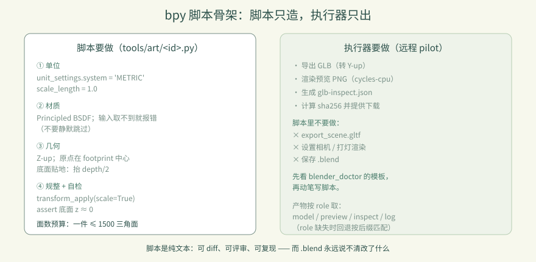

# 卷 3 · 第 14 章　bpy 脚本：米制、Z-up，只建几何

> **本章目标**：掌握建模脚本与执行器之间的**契约**——
> 写什么、不写什么，以及一个"看起来能跑但放进游戏就错位"的脚本错在哪。
>
> 对应任务：T09–T15（资产）　|　对应文件：`tools/art/barrel.py`、`tools/art/*.py`

---

## 14.1 契约：脚本只负责"造"，不负责"出"

远程执行器（第 15 章）会跑你的 `bpy` 脚本，然后**它自己**导出 GLB、渲染预览。
所以脚本必须遵守四条约定：

| 约定 | 内容 |
|---|---|
| **米制** | `scene.unit_settings.system = 'METRIC'`，`scale_length = 1.0` |
| **Z-up** | 高度沿 `+Z`（Blender 原生），执行器负责转 Y-up 给 glTF |
| **原点在 footprint 中心** | 这样放进游戏格子时对齐的是底面中心 |
| **基座贴地 z=0** | 底面必须正好在 `z = 0`，不能悬空也不能陷进去 |

**脚本里不要做的事**：导出 GLB、设置相机、打灯渲染、保存 .blend——这些是执行器的活。

---

## 14.2 逐段读 `barrel.py`

```python
import bpy
from mathutils import Vector

scene = bpy.context.scene
scene.unit_settings.system = 'METRIC'      # ① 米制
scene.unit_settings.scale_length = 1.0
```

```python
def material(name, base_color, roughness, metallic):
    mat = bpy.data.materials.new(name)
    mat.use_nodes = True
    bsdf = next(node for node in mat.node_tree.nodes if node.type == 'BSDF_PRINCIPLED')
    for socket_name, value in {...}.items():
        socket = bsdf.inputs.get(socket_name)
        if socket is None:
            raise RuntimeError(f'Required Principled BSDF input missing: {socket_name}')
        socket.default_value = value
    return mat
```

**② 这段有个很值得学的设计**：`socket is None` 时**直接抛错**，而不是静默跳过。
不同 Blender 版本的 Principled BSDF 输入名会变——静默跳过会得到"材质丢了但脚本说成功"，
显式报错则让问题暴露在执行端。

```python
bpy.ops.mesh.primitive_cylinder_add(vertices=16, radius=0.28, depth=0.7,
                                    location=Vector((0.0, 0.0, 0.35)))
```
**③ `location.z = 0.35`**：圆柱原点在几何中心，高 0.7，所以要抬一半 → 底面正好在 0。

```python
for obj in (body, lid, ...):
    bpy.ops.object.select_all(action='DESELECT')
    obj.select_set(True)
    bpy.context.view_layer.objects.active = obj
    bpy.ops.object.transform_apply(location=False, rotation=False, scale=True)
```
**④ 应用缩放**：`primitive_*_add` 之后若有非 1 缩放，导出时法线/尺寸都可能出问题。

```python
bottom = min((body.matrix_world @ Vector(corner)).z for corner in body.bound_box)
assert abs(bottom) < 1e-6, f'barrel must sit on z=0, got {bottom}'
```
**⑤ 自检断言**：把"贴地"这条契约写成代码。不写它，错位只会在游戏里才被发现。



---

## 14.3 面数预算

本实训的定位是**低模**：

| 资产 | 三角面 |
|---|---|
| 木桶 `barrel` | 632 |
| 存量 8 件 | 数百量级 |

**经验值**：一件道具控制在 **≤ 1500 三角面**。
圆柱 `vertices=16` 已经是很好的平衡——再高肉眼看不出，再低会有明显棱角。

> 📌 面数不是"越低越好"，而是"**看不出来就该降**"。用预览图（执行器会给）判断。

---

## 14.4 命名与组织

- 脚本：`tools/art/<id>.py`，`<id>` 与 `palette.json` 的 `id`、GLB 文件名**三者一致**
- 对象名：`BarrelBody` / `BarrelBand0`… 有语义，方便在 Blender 里排查
- 材质名：`BarrelWood` / `BarrelBand`，导出后成为 Godot 里的材质槽

---

### 🌩 在云端 agent（web-cb）里是什么样

| | 🖥 本地路线 | 🌩 云端 agent（web-cb） |
|---|---|---|
| Blender 版本 | 本地 4.2（GUI，需手点插件） | 远程 **Blender 5.2.1**（无头执行） |
| 脚本契约 | 同 | **完全相同**——这正是契约的价值：换执行端不用改脚本 |
| 面数/预览 | 本地看 | 云端返回 `glb-inspect.json` + 回导预览 PNG |
| 注意 | 本地 MCP 插件**拒绝后台模式** | 云端本来就是无头，**这是它最合适的用法** |

> 🌩 远程执行的额外好处：**脚本是纯文本**，天然可版本控制、可 diff、可复现——
> 而 `.blend` 是二进制，永远说不清改了什么。

---

## 14.5 常见坑速查（本章）

| 现象 | 原因 | 处理 |
|---|---|---|
| 模型在游戏里巨大/极小 | 单位不是米 | 设 `METRIC` + `scale_length = 1.0` |
| 模型悬空或陷地 | 原点没在底面 | 抬 `depth/2`，并用 assert 自检 |
| 放进格子偏半格 | 原点不在 footprint 中心 | 几何居中于 (0,0) |
| 材质全白 | BSDF 输入名取不到 | 显式 `RuntimeError`，别静默跳过 |
| 法线奇怪/尺寸异常 | 没 apply scale | `transform_apply(..., scale=True)` |
| 面数爆表 | 分段数给太大 | 圆柱 16 段，圆环 16×8 足够 |

---

## 14.6 本章作业

1. 说出脚本与执行器之间的四条契约，并指出 `barrel.py` 里各自对应哪一行
2. 写一个 `crate.py`（木箱）：边长 0.5 m 的立方体，加两道深色边框，底面贴地，含 assert 自检
3. 把 `barrel.py` 的圆柱段数改成 32，观察面数变化，说明是否值得
4. 解释为什么 `socket is None` 要抛错而不是跳过

---

## 🎓 教学提示（给教师 / 直播主）

- **概念锚点**：**契约**——脚本与执行器分工明确，才能换执行端不改代码。
- **课堂演示**：故意删掉 `location.z = 0.35`，看模型陷进地面。
- **高频误解**：学生想在脚本里写 `bpy.ops.export_scene.gltf()`。说明：导出是执行器的职责。
- **讨论题**：为什么"自检断言"要写在建模脚本里？（答：错误越早暴露越便宜）
- **批改要点**：作业 2 必须有单位设置、原点处理和 `assert`。

---

## 📹 录屏分镜（9 分钟）

| 时间 | 画面 | 解说词要点 |
|---|---|---|
| 00:00–01:30 | 四条契约 +  barrel.py 头部 | "脚本只造，不出。" |
| 01:30–03:00 | 材质段的 None 检查 | "取不到就报错，别假装成功。" |
| 03:00–04:30 | location.z = 0.35 的几何推导 | "圆柱原点在中心，所以要抬一半。" |
| 04:30–05:40 | transform_apply + assert 自检 | "契约写成代码。" |
| 05:40–07:00 | 面数预算与预览图判断 | "看不出来就该降。" |
| 07:00–09:00 | 作业 + 预告（远程执行） | |

## 🖼 配图清单

| 文件名 | 内容 | 生成方式 |
|---|---|---|
| `14-game-start.png` | 起始画面（新资产的落点） | `python tools/course_capture.py --chapter 14` |
| `14-barrel-selected.png` | 选中木桶（GLB 已进工程） | 同上 |

## 🎥 直播脚本（L3 片段，10 分钟）

- **开场**："给我一个 .blend，我怎么知道你改了什么？"——引出脚本化建模
- **演示**：现场写 crate.py 并提交（用第 15/16 章的管线）
- **互动**：比谁的面数更低但看起来一样
- **收尾**：预告远程执行

## ❓ 本章 FAQ

**Q：为什么不用 .blend 直接入库？**
A：二进制不可 diff、不可复现、依赖 Blender 版本。脚本是纯文本，可评审可重跑。

**Q：Z-up 还是 Y-up？**
A：脚本里按 Blender 原生 Z-up 写；glTF 标准是 Y-up，由执行器转换，你不用管。

**Q：能用法线贴图/纹理吗？**
A：本实训走"只建几何与材质"的纯色低模路线，不用贴图——这是风格选择，也是体积考量。
