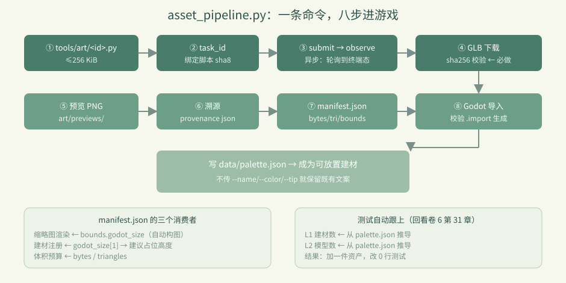

# 卷 3 · 第 16 章　asset_pipeline.py：一条命令，从脚本到可放置建材

> **本章目标**：读通"造资产 → 进游戏"的**自动化主线**，
> 理解每一步为什么存在，以及**溯源（provenance）**为什么是商业项目的必需品。
>
> 对应任务：T12 / T13　|　对应文件：`tools/asset_pipeline.py`

---

## 16.1 一条命令

```powershell
python tools/asset_pipeline.py build --id barrel --name 木桶 --category 建筑 \
       --color b07d4f --tip "码头边的橡木桶，可以一只只堆起来。"
python tools/asset_pipeline.py list      # 看全部资产与是否已注册
```

常用开关：`--no-register`（只出资产不注册）/ `--no-import`（不跑 Godot 导入）/
`--retry`（换任务 id 重跑）/ `--timeout`（默认 300 秒）/ `--height`（占位格数）。

---

## 16.2 八步主线

```
① 读 tools/art/<id>.py，检查 ≤256 KiB
② 算任务 id（绑定脚本摘要）
③ blender_submit → 轮询 observe → artifacts
④ 下载 GLB（sha256 校验）→ 写 assets/models/<id>.glb
⑤ 预览 PNG → art/previews/<id>.png
⑥ 写溯源 art/provenance/<id>.json
⑦ 更新 assets/models/manifest.json（bytes / triangles / bounds）
⑧ Godot headless 导入（校验 .import 真的生成）→ 写 data/palette.json
```



---

## 16.3 为什么要写 `manifest.json`

```json
"assets": [{ "id": "barrel", "bytes": 44580, "triangles": 632,
             "bounds": { "godot_size": [0.614, 0.72, 0.614] }, ... }]
```

它有三个消费者：

| 消费者 | 用哪个字段 |
|---|---|
| **缩略图渲染** | `bounds.godot_size` → 自动构图（第 13 章） |
| **建材注册** | `godot_size[1]` → 建议占位高度 `ceil(h)` |
| **体积预算** | `bytes` / `triangles` → 控制包体与面数 |

> 📌 一句话：**manifest 是"资产的体检报告"**，让后续环节不必重新解析 GLB。

---

## 16.4 为什么要写 `provenance`

```json
{ "id": "barrel", "version": 2, "task_id": "mist-harbor-barrel-v2-a52aa92e",
  "script": "tools/art/barrel.py", "script_sha256": "...", "glb_sha256": "...",
  "bytes": 44580, "triangles": 632, "generated_at": "2026-09-15T..." }
```

**它回答"这个二进制是哪来的"**：
哪版脚本、哪个任务、什么时候、校验值是什么。

对商业项目的意义：
- 出问题能**追溯到脚本版本**，而不是对着二进制猜
- 换机器/换人重建，能验证**产物一致**（sha256 相同）
- 审计与版权存证

> 📌 二进制入库而**没有**溯源，是资产管线的头号技术债。

---

## 16.5 注册建材：只覆盖调用方给的值

```python
register_palette(args.id, args.name, args.category, args.color, height, args.tip, suggested_height)
```

设计要点：`--name` / `--color` / `--tip` **不传就保留既有值**。
这样重跑管线（比如换了建模脚本）不会把已经调好的中文名和提示文案冲掉——
**重跑只更新几何，不动文案**。

`suggested_height` 由 bounds 推导：`max(1, ceil(godot_size[1]))`，
即"模型有多高就占几格"。

---

## 16.6 与测试的衔接（回看卷 6）

管线在 ⑧ 之后，第 31 章那三条"写死数量"的断言**自动成立**：

- `palette.json` 多一项 → L1 从 `palette.json` 推导建材数 ✅
- `manifest.json` 多一项、GLB 多一个 → L2 从 `palette.json` 推导模型数 ✅
- L3 同理 ✅

**这就是"数据源驱动"的复利**：加一件资产，改 0 行测试。

---

## 16.7 存量资产怎么办

现有 8 件资产来自 `project/art/generate_harbor.py`（整体重建式脚本，一次重建全部）。
迁移策略：

1. 为每件资产写一个 `tools/art/<id>.py`（按第 14 章契约）
2. 走管线：`build --id <id>` 逐件替换
3. 用 `list` 确认 manifest 与 palette 一致
4. 保留 `generate_harbor.py` 作为"批量参考实现"，不再作为主路径

---

### 🌩 在云端 agent（web-cb）里是什么样

| | 🖥 本地路线 | 🌩 云端 agent（web-cb） |
|---|---|---|
| 管线本身 | `tools/asset_pipeline.py` | 同一脚本，或平台内用 MCP 工具串起来 |
| 远程 Blender | HTTP 直连 | 平台原生调用（更快更稳） |
| Godot 导入 | 本地 4.7 headless | 平台内执行同命令（对齐 `features`） |
| 产物落盘 | 本地工程目录 | 平台工作区 → 需要同步回仓库 |
| 建议 | 本地跑通再提交 | **云端把"提交脚本 → 审核 GLB → 合并"做成流水线** |

> 🌩 云端最理想形态：**只提交 .py 脚本，二进制由流水线生成并校验 sha256**，
> 仓库里永远只有文本 + 溯源，没有"不知道怎么来的 GLB"。

---

## 16.8 常见坑速查（本章）

| 现象 | 原因 | 处理 |
|---|---|---|
| `missing authoring script` | 没写 `tools/art/<id>.py` | 先写脚本（第 14 章） |
| 任务 id 冲突 | 脚本没变却想重跑 | 改用 `--retry` |
| `Godot did not produce .import` | 导入没真跑 | 检查 `tools.json` 引擎路径 |
| 加了资产测试仍红 | 断言写死数量 | 见第 31 章（从 palette 推导） |
| 文案被重置 | 重跑传了 `--name/--tip` | 不传就保留既有值 |
| 占位高度不对 | bounds 没更新 | 检查 manifest 是否被写入 |

---

## 16.9 本章作业

1. 按序列出管线八步，指出哪一步会"校验"、校验的是什么
2. 说出 `manifest.json` 的三个消费者各自用哪个字段
3. 解释为什么重跑管线时"不传 `--name` 就保留既有文案"是好设计
4. 选一件存量资产（例如 `lamp`），写出迁移到 `tools/art/lamp.py` 的要点清单（不用真写完整脚本）

---

## 🎓 教学提示（给教师 / 直播主）

- **概念锚点**：**自动化 = 把人工步骤固化成可重跑的命令**；**溯源 = 让二进制可解释**。
- **课堂演示**：现场跑一次 `build --id barrel --no-register`，看八步输出。
- **高频误解**：学生觉得"GLB 能出来就行"。追问：三个月后你怎么知道它是哪个脚本产出的？
- **讨论题**：二进制该不该入库？（本实训：入库 + 溯源 + 脚本可复现）
- **批改要点**：作业 2 要答出缩略图 / 注册 / 预算三个消费者。

---

## 📹 录屏分镜（10 分钟）

| 时间 | 画面 | 解说词要点 |
|---|---|---|
| 00:00–01:20 | 一条命令 + 八步主线 | "从脚本到可放置建材。" |
| 01:20–03:00 | manifest 三个消费者 | "体检报告，供三个人用。" |
| 03:00–04:30 | provenance 内容逐字段 | "这个二进制是哪来的？" |
| 04:30–06:00 | 注册只覆盖传入值 | "重跑不动文案。" |
| 06:00–07:30 | 与卷 6 断言的衔接 | "加资产，改 0 行测试。" |
| 07:30–10:00 | 存量迁移策略 + 作业 | |

## 🖼 配图清单

| 文件名 | 内容 | 生成方式 |
|---|---|---|
| `16-island-with-barrel.png` | 岛上有管线产出的木桶 | `python tools/course_capture.py --chapter 16` |
| `16-progress-after.png` | 完成任务进度后的面板 | 同上 |

## 🎥 直播脚本（L3 片段，12 分钟）

- **开场**："你的仓库里有没有说不清来历的二进制？"
- **演示**：跑一次完整 build（含 sha256 校验与 manifest 写入）
- **互动**：让观众设计 provenance 还应该记什么（作者、许可、引擎版本？）
- **收尾**：卷 3 小结 + 预告卷 4（玩法系统）

## ❓ 本章 FAQ

**Q：能不能跳过 Godot 导入？**
A：`--no-import` 可以，但那样 `.import` 不会生成，游戏里加载不到新资产。仅调试用。

**Q：manifest 和 provenance 会进导出包吗？**
A：`manifest.json` 在 `assets/` 下会进包（运行时读 bounds）；
`art/provenance/` 属于 `art/`，被 `export_presets.cfg` 排除，不进包——它只服务开发。

**Q：一次能加多件吗？**
A：循环调用 `build` 即可；但**建议一件一件验**（预览图 + 游戏内效果），避免批量返工。
