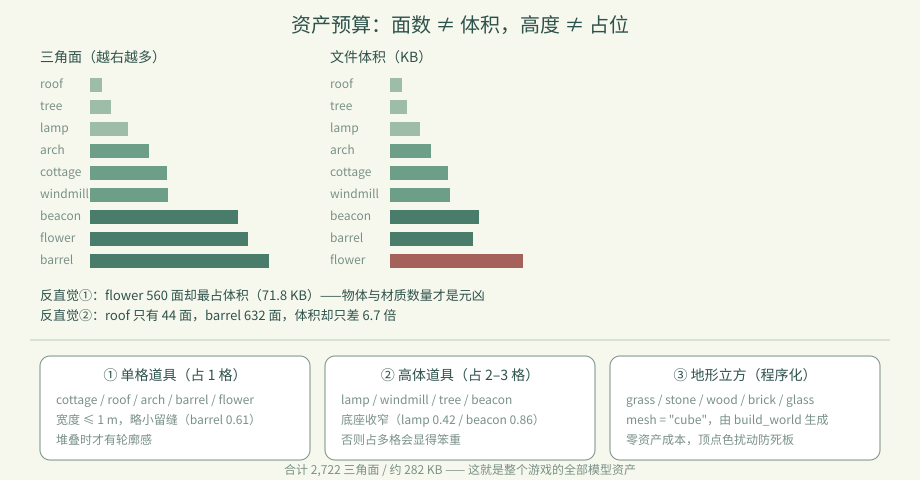

# 卷 3 · 第 17 章　9 件资产逐个拆解：面数、体积与"为什么长这样"

> **本章目标**：把 9 件 GLB 摊开看——**面数 ≠ 体积**，**高度 ≠ 占位格数**，
> 以及每件资产的造型决策背后的取舍。
>
> 对应任务：T09–T15　|　对应文件：`assets/models/manifest.json`、`data/palette.json`

---

## 17.1 一张表看懂全部资产

| id | 中文名 | 三角面 | 文件 | 尺寸（宽×高×深 m） | 建材表高度 |
|---|---|---:|---:|---|---:|
| `roof` | 草屋顶 | **44** | 6.6 KB | 1.10 × 0.66 × 1.08 | 1 |
| `tree` | 乔木 | 72 | 9.1 KB | 0.92 × 1.80 × 0.89 | 2 |
| `arch` | 桥拱 | 208 | 22.0 KB | 1.00 × 1.00 × 1.00 | 1 |
| `cottage` | 渔村小屋 | 272 | 31.5 KB | 1.03 × 1.00 × 1.03 | 1 |
| `windmill` | 风车 | 276 | 32.3 KB | 0.94 × **1.71** × 0.95 | 2 |
| `lamp` | 暖光灯 | 134 | 16.4 KB | 0.42 × 1.25 × 0.42 | 2 |
| `flower` | 花丛 | 560 | **71.8 KB** | 0.85 × 0.32 × 0.85 | 1 |
| `beacon` | 灯塔 | 524 | 47.9 KB | 0.86 × **2.80** × 0.86 | 3 |
| `barrel` | 木桶 | 632 | 44.6 KB | 0.61 × 0.72 × 0.61 | 1 |

合计 **2,722 三角面 / 约 282 KB**——这就是整个游戏的全部模型资产。

---

## 17.2 第一个反直觉：**面数 ≠ 体积**

看两组对照：

| 对比 | 结论 |
|---|---|
| `flower` 560 面 / **71.8 KB** vs `windmill` 276 面 / 32.3 KB | 花丛面数只有 2 倍，体积却是 2 倍多 |
| `roof` 44 面 / 6.6 KB vs `barrel` 632 面 / 44.6 KB | 面数差 14 倍，体积差不到 7 倍 |

**为什么？** GLB 体积还取决于：
- **物体与材质数量**（每个 mesh / material 都有元数据开销）
- 顶点属性（法线、UV、顶点色）
- 是否共享几何（实例化/复用）

> 📌 所以优化包体时，**别只盯面数**。减少物体数、合并材质，往往比减面更有效。

---

## 17.3 第二个反直觉：**高度 ≠ 占位格数**

建材表里的 `height` 是 `ceil(godot_size[1])`：

| 资产 | 实际高 | 占位 |
|---|---:|---:|
| `lamp` | 1.25 m | **2** 格 |
| `windmill` | 1.71 m | **2** 格 |
| `beacon` | 2.80 m | **3** 格 |
| `flower` | 0.32 m | 1 格 |

这是**向上取整**的必然结果：格子是离散的，1.25 m 的灯必须占 2 格才不会插进上面的方块。
副作用是"看起来没那么高的东西占了 2 格"——**这是网格建造游戏的固有权衡**（第 06 章）。

---

## 17.4 三种原型

```
① 单格道具（占 1 格）   cottage / roof / arch / barrel / flower
② 高体道具（占 2–3 格） lamp / windmill / tree / beacon
③ 地形立方（mesh=cube，程序化） grass / stone / wood / brick / glass
```

| 原型 | 设计要点 |
|---|---|
| 单格道具 | 宽度控制在 **≤1 m**，留出缝隙感；`barrel` 只有 0.61 m，故意做小显得可堆叠 |
| 高体道具 | 底座要收窄（`lamp` 0.42 m），否则占 2–3 格会显得笨重 |
| 地形立方 | 不建模，由 `build_world.gd` 程序化生成（第 10 章），**零资产成本** |

---

## 17.5 从 manifest 里还能读出什么

```json
"seed": 240910, "license": "CC0-1.0", "units": "meters",
"gltf_up_axis": "Y", "generator": "Blender 4.2.0"
```

| 字段 | 用途 |
|---|---|
| `seed` | 程序化地形/起始村庄的固定种子 → **可复现** |
| `license` | CC0-1.0，商用无顾虑 |
| `units` / `gltf_up_axis` | 契约声明，防止换工具链时静默失真 |
| `source` / `task_id` | **溯源**：`arch-v2-c31bcd14` 说明它重做过（v2），`lamp` 也是 v2 |

> 📌 `source` 字段现在是 `tools/art/<id>.py`——说明这 9 件都已经（或正在迁移到）脚本化管线。



---

### 🌩 在云端 agent（web-cb）里是什么样

| | 🖥 本地路线 | 🌩 云端 agent（web-cb） |
|---|---|---|
| 资产生成 | 本地/远程管线 | 远程 pilot（Blender 5.2.1）批量产出 |
| manifest | 管线自动写入 | 同；**建议把"面数/体积超阈值"做成流水线卡点** |
| 版本迭代 | 改脚本 → v2/v3 | 同；task_id 带摘要，历史可追溯 |
| 建议 | 本地先看预览图 | 云端可**并行**造多件，但**逐件验收**（面数/比例/风格） |

> 🌩 云端造资产很容易"批量产出但风格漂移"——第 18 章就是为此准备的。

---

## 17.6 常见坑速查（本章）

| 现象 | 原因 | 处理 |
|---|---|---|
| 模型看起来正常但卡 | 面数不高但物体/材质太多 | 合并 mesh、减少材质数 |
| 矮道具占了 2 格 | `ceil` 向上取整 | 调低模型高度或接受该权衡 |
| 道具穿进上层方块 | height 算小了 | 用 `godot_size[1]` 推导，别手写 |
| 换机器后地形不一样 | seed 变了 | 固定 `seed`（240910） |
| 不知道某个 GLB 哪来的 | 缺溯源 | 看 manifest 的 `source` / `task_id` |

---

## 17.7 本章作业

1. 说出两个"面数 ≠ 体积"的证据，并解释体积还受什么影响
2. 计算：`beacon` 高 2.80 m 为什么占 3 格？如果把它改成 2.4 m，占位会变成几格？
3. 按三种原型给 9 件资产分类，并说明各自的设计要点
4. 挑一件资产，提出一个"降体积但外观不变"的具体改法（合并什么、复用什么）

---

## 🎓 教学提示（给教师 / 直播主）

- **概念锚点**：**预算意识**——面数、体积、占位格数，是三笔不同的账。
- **课堂演示**：把 `flower`（71.8 KB）和 `windmill`（32.3 KB）的预览图并排，让学员猜谁面数高。
- **高频误解**：学生以为"减面 = 减包体"。用本章数据纠正。
- **讨论题**：如果包体只能再放 50 KB，你砍哪一件？怎么砍？
- **批改要点**：作业 2 要答出 2.4 m → 3 格（ceil(2.4)=3），容易错答 2 格。

---

## 📹 录屏分镜（9 分钟）

| 时间 | 画面 | 解说词要点 |
|---|---|---|
| 00:00–01:40 | 九件资产表 + 合计 2722 面 | "整个游戏的模型，就这么点。" |
| 01:40–03:00 | flower vs windmill 的反直觉对照 | "面数不等于体积。" |
| 03:00–04:20 | 高度 ceil 表（lamp 1.25→2） | "格子是离散的，这是固有权衡。" |
| 04:20–06:00 | 三种原型与宽度控制 | |
| 06:00–07:30 | manifest 的 seed / license / 溯源字段 | |
| 07:30–09:00 | 作业 + 预告（风格统一） | |

## 🖼 配图清单

| 文件名 | 内容 | 生成方式 |
|---|---|---|
| `17-windmill-placed.png` | 放置风车（高体道具占 2 格） | `python tools/course_capture.py --chapter 17` |
| `17-tree-placed.png` | 放置乔木（自然类高体） | 同上 |

## 🎥 直播脚本（L3 片段，10 分钟）

- **开场**："猜一猜：花丛和风车，谁更占地方？"——揭晓 71.8 KB vs 32.3 KB
- **演示**：在 Blender 里把花丛合并成一个 mesh，看体积变化
- **互动**：让观众给自己的项目做一张"资产预算表"
- **收尾**：预告风格统一

## ❓ 本章 FAQ

**Q：为什么 flower 这么大？**
A：它由多个小花物体组成，物体数与材质元数据占了大头。合并成一个 mesh 能显著减小。

**Q：占位格数能手动指定吗？**
A：可以（管线 `--height`），但建议让它从 bounds 推导，避免模型和规则不一致。

**Q：CC0-1.0 能商用吗？**
A：可以，无需署名。但这是**本项目自产资产**的声明；若引入外部素材要单独核对许可。
