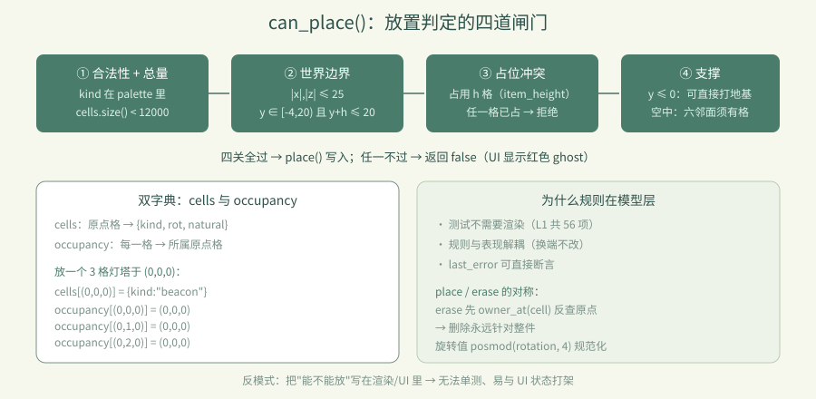

# 卷 4 · 第 19 章　放置规则：支撑、占位与世界边界

> **本章目标**：读懂 `can_place()` 的四道闸门，理解 **`cells` 与 `occupancy` 双字典**
> 如何解决"多格模型"的问题，以及为什么规则要放在模型层而不是渲染层。
>
> 对应任务：T16 / T17　|　对应文件：`project/scripts/world_model.gd`

---

## 19.1 两个字典：`cells` 与 `occupancy`

```gdscript
var cells: Dictionary = {}       # 原点格 → {kind, rot, natural}
var occupancy: Dictionary = {}   # 每一格 → 它属于哪个原点格
```

`beacon` 高 3 格，放在 `(0,0,0)`：

```
cells:     (0,0,0) → {kind:"beacon", rot:0}
occupancy: (0,0,0) → (0,0,0)
           (0,1,0) → (0,0,0)      ← 上半截也指向同一原点
           (0,2,0) → (0,0,0)
```

于是查询变成两步：

```gdscript
func has_cell(cell) -> bool:        return occupancy.has(cell)      # 这一格有东西吗
func owner_at(cell) -> Vector3i:    return occupancy.get(cell, cell) # 它属于哪一件
func get_cell(cell) -> Dictionary:  return cells.get(owner_at(cell), {})
```

> 📌 这就是第 06 章"点灯塔上半截会删掉整座"的**数据结构基础**（第 10 章是渲染侧落地）。

---

## 19.2 `can_place()` 的四道闸门

```gdscript
func can_place(cell, kind) -> bool:
	if not palette.has(kind) or cells.size() >= MAX_CELLS:   return false   # ①
	var height := item_height(kind)
	if not in_bounds(cell, height):                          return false   # ②
	for dy in range(height):
		if occupancy.has(cell + Vector3i(0, dy, 0)):         return false   # ③
	if cell.y <= 0:                                          return true    # ④a
	for direction in [UP, DOWN, LEFT, RIGHT, FORWARD, BACK]:
		if occupancy.has(cell + direction):                  return true    # ④b
	return false
```

| 闸门 | 规则 | 常量 |
|---|---|---|
| ① **合法性 + 总量** | 建材必须存在；总数 < 12000 | `MAX_CELLS = 12000` |
| ② **边界** | `|x|,|z| ≤ 25`；`y ∈ [-4, 20)` 且 `y + height ≤ 20` | `EDGE=25, MIN_Y=-4, MAX_Y=20` |
| ③ **占位冲突** | 每件占用 `height` 格，任一格已占就不行 | `item_height()` |
| ④ **支撑** | `y ≤ 0`（水面/地下）可直接打地基；否则**六邻面必须有已占格** | — |

**④ 的设计意图**：水面上可以凭空起柱子（符合"打地基"直觉），
但**空中不能悬空堆放**——必须有相邻方块托着。这既防"空中楼阁"，又不限制 creativity。

---

## 19.3 为什么规则在模型层，不在渲染层

```
UI 点击 → main.gd → world.pick() → model.can_place() → 合法才 place()
                                        ↑
                                   唯一的裁判
```

好处：

1. **测试不需要渲染**：L1 的 56 项断言直接调 `model.place()`（第 29 章）
2. **规则与表现解耦**：换渲染方式、做移动端、做服务端校验，规则都不变
3. **错误可见**：`last_error` 记录原因，可直接断言（第 31 章提到）

> 📌 反模式：把"能不能放"写在 `_process` 或渲染代码里 → 无法单测、容易与 UI 状态打架。

---

## 19.4 `place()` 与 `erase()` 的对称

```gdscript
func place(cell, kind, rotation=0) -> bool:
	if not can_place(cell, kind): return false
	var value := {"kind": kind, "rot": posmod(rotation, 4), "natural": false}
	_record(cell, {}, value)                     # before={} → 撤销即删除
	if value["rot"] != 0: stats["rotated"] += 1
	return true

func erase(cell) -> bool:
	var origin := owner_at(cell)                 # 先反查原点！
	if not cells.has(origin): return false
	_record(origin, cells[origin].duplicate(), {})   # after={} → 撤销即恢复
	stats["removed"] += 1
	return true
```

**两个细节值得学**：

- `erase` 第一行就 `owner_at(cell)`——**删除永远针对整件，不是被点到的那一格**
- `posmod(rotation, 4)`——旋转值永远规范到 0–3，避免脏数据

---

## 19.5 统计也是数据的一部分

```gdscript
var stats := {"rotated": 0, "undone": 0, "saved": 0, "removed": 0}
```

成就系统直接消费它（`undone` ≥ 10 → "谨慎的手"；`saved` ≥ 5 → "档案管理员"）。
**把统计放进模型而非 UI**，成就计算就有了单一来源（第 13 章）。



---

### 🌩 在云端 agent（web-cb）里是什么样

| | 🖥 本地路线 | 🌩 云端 agent（web-cb） |
|---|---|---|
| 规则层 | 本地 GDScript | **完全相同**（纯逻辑，与平台无关） |
| 验证 | `dev.py test`（56 项） | 云端 CI 跑同一套，**最可靠的一层** |
| 常量调整 | 改 `MAX_CELLS` 等 | 改完必须跑 L1——断言从常量推导，改了会立刻暴露不一致 |
| 建议 | — | 把四道闸门各写"正例 + 反例"两条断言，云端回归最有价值 |

> 🌩 规则层是**最容易在云端自动化验证**的部分：不需要 GPU、不需要浏览器、秒级完成。

---

## 19.6 常见坑速查（本章）

| 现象 | 原因 | 处理 |
|---|---|---|
| 点上半截只删上半截 | `erase` 没走 `owner_at` | 先反查原点 |
| 高模型放不下 | ② 用了 `y + height` | 边界检查要带高度 |
| 空中能凭空堆 | ④ 只在 `y ≤ 0` 放行 | 六邻面检查要覆盖空中 |
| 超出 12000 还能放 | ① 用 `>` 而非 `>=` | 边界条件是 `>= MAX_CELLS` |
| 旋转值越来越大 | 没 `posmod` | `posmod(rotation, 4)` |
| 规则改了但 UI 没同步 | 规则写在 UI 里 | 收敛到模型层 |

---

## 19.7 本章作业

1. 画出 `cells` / `occupancy` 在放置一个 3 格灯塔后的内容（照 19.1 的格式）
2. 说出四道闸门各自的常量，指出"在 y=19 放 2 格灯塔"会被哪一道拦下
3. 解释为什么"水面可打地基、空中必须相邻"是合理的设计取舍
4. 给第 ② 道闸门补两条断言（一条边界内成功、一条越界失败），跑 `dev.py test` 验证

---

## 🎓 教学提示（给教师 / 直播主）

- **概念锚点**：**双字典 = 逻辑格 ↔ 物理格**的映射，是多格模型的通用解法。
- **课堂演示**：放灯塔，用 print 打出两个字典，让学生看到"3 个 key 指向 1 个原点"。
- **高频误解**：学生以为 `cells` 一个字典就够。追问：那怎么知道 `(0,2,0)` 是灯塔的一部分？
- **讨论题**：如果要支持"悬空platform"，第 ④ 道闸门该怎么改？
- **批改要点**：作业 2 要答出第 ② 道（`19 + 3 > 20`）。

---

## 📹 录屏分镜（9 分钟）

| 时间 | 画面 | 解说词要点 |
|---|---|---|
| 00:00–02:00 | 双字典示意图（灯塔 3 格） | "逻辑格 vs 物理格。" |
| 02:00–04:30 | 四道闸门逐行读 | "四关，缺一不可。" |
| 04:30–06:00 | place / erase 的对称与 owner_at | "删除永远针对整件。" |
| 06:00–07:00 | stats 与成就的衔接 | |
| 07:00–09:00 | 作业 + 预告（撤销栈） | |

## 🖼 配图清单

| 文件名 | 内容 | 生成方式 |
|---|---|---|
| `19-place-build.png` | 建造若干方块（规则生效的现场） | `python tools/course_capture.py --chapter 19` |
| `19-demolish-mode.png` | 拆除模式（ghost 变红/整件高亮） | 同上 |

## 🎥 直播脚本（L3 片段，10 分钟）

- **开场**："点灯塔上半截，会发生什么？"——投票后揭晓（删整座）
- **演示**：关掉 `owner_at` 看 bug 复现，再修好
- **互动**：让观众设计一个"悬空也能放"的规则变体
- **收尾**：预告撤销栈

## ❓ 本章 FAQ

**Q：为什么 `MAX_CELLS` 是 12000？**
A：来自 `requirements.md` 的性能预算：全量重建 + trimesh 碰撞下的安全上限。

**Q：`natural` 字段是干什么的？**
A：标记"起始村庄/地形"等**非玩家建造**的格子，不计入玩家统计与成就（第 13、18 章）。

**Q：能不能一次放多个（笔刷）？**
A：`main.gd` 的 `painting` 已支持拖动连续绘制（每 0.17s 一次），规则层无需改动。
