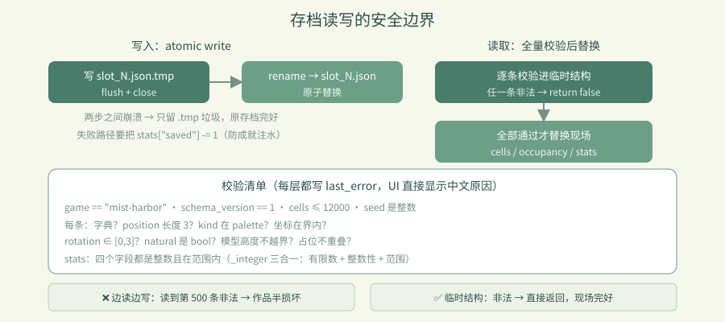

# 卷 4 · 第 21 章　存档槽与文档格式：坏存档不能毁掉当前作品

> **本章目标**：读懂 `load_document()` 的**全量校验 + 原子替换**，
> 以及"先写 .tmp 再改名"为什么在 Web 上尤其重要。
>
> 对应任务：T18 / T19（存档槽）　|　对应文件：`world_model.gd` 的文档与槽位部分

---

## 21.1 文档长什么样

```json
{
  "schema_version": 1,
  "game": "mist-harbor",
  "seed": 240910,
  "cells": [
    {"position": [0,0,0], "kind": "beacon", "rotation": 0, "natural": false},
    {"position": [3,0,2], "kind": "cottage", "rotation": 2, "natural": false}
  ],
  "stats": {"rotated": 12, "undone": 3, "saved": 5, "removed": 1}
}
```

| 字段 | 作用 |
|---|---|
| `schema_version` / `game` | **格式标识**：拒绝别的游戏/别的版本的文件 |
| `seed` | 世界种子，保证地形可复现 |
| `cells` | 只存**原点格**（+ rotation），多格由 `height` 推导占哪些格 |
| `natural` | 区分起始村庄与玩家建造 |
| `stats` | 操作统计（成就跨会话累计） |

**按 (x, y, z) 排序后写入** → 同一份世界每次序列化结果完全一致，
方便 diff 与校验（第 17 章的"可复现"是同一思路）。

---

## 21.2 载入：先全量校验，再整体替换

```gdscript
func load_document(document) -> bool:
	last_error = ""
	if not document is Dictionary or document.get("game") != "mist-harbor" \
	   or document.get("schema_version") != SAVE_VERSION:
		last_error = "不是受支持的雾港存档（需要版本 1）。"
		return false
	...
	# 全部验证完成后才替换现场，坏存档不能破坏当前作品。
	var next_cells := {}
	var next_occupancy := {}
	for entry in entries:
		...  # 逐条校验，任何一条不合法就 return false（此时 cells 没被动过）
	cells = next_cells          # ← 只有走到这里才替换
	occupancy = next_occupancy
```

**这是本章最重要的一行注释。** 两种做法的差别：

| 做法 | 后果 |
|---|---|
| ❌ 边读边写 | 读到第 500 条发现非法 → 前 499 条已生效，作品**半损坏** |
| ✅ 先建临时结构，全部通过再替换 | 非法 → 直接返回 false，**现场完好无损** |

校验清单（每层都写 `last_error`，UI 能直接显示中文原因）：

```
游戏标识 / 版本 → 格子总数 ≤ 12000 → seed 是整数 →
每条：是字典？position 长度 3？kind 在 palette 里？坐标在范围内？
      rotation ∈ [0,3]？natural 是 bool？模型高度不越界？→ 占位不重叠？
stats：四个字段都是整数且在范围内
```

`_integer()` 还专门检查**有限数**与**整数性**，挡住 `NaN` / `1.5` / 超大值。

---

## 21.3 保存：先写 `.tmp`，再改名

```gdscript
func save_slot(index) -> bool:
	stats["saved"] += 1
	var output := FileAccess.open(path + ".tmp", FileAccess.WRITE)
	if output == null:
		stats["saved"] -= 1        # ← 失败要回滚计数器
		last_error = "无法写入存档槽 %d，请使用导出 JSON。"
		return false
	output.store_string(JSON.stringify(to_document()))
	output.flush(); output.close()
	if DirAccess.rename_absolute(path + ".tmp", path) != OK:
		stats["saved"] -= 1
		last_error = "保存失败，请导出 JSON 备份。"
		return false
	current_slot = index
	dirty = false
```

**为什么多一步改名？**
写一半断电/崩溃 → 只会留下一个 `.tmp` 垃圾文件，**原来的存档完好**。
直接写目标文件则可能留下**半截 JSON**——下次再也读不回来。

> 📌 这个模式叫 **atomic write**，是本地与 Web 都通用的稳妥做法。

**另一个细节**：`stats["saved"] += 1` 之后若失败要 `-= 1`，
否则"档案管理员"成就（保存 5 次）会被失败的操作注满水。

---

## 21.4 三个槽位与旧存档迁移

```gdscript
const SLOT_COUNT := 3
static func slot_path(index: int) -> String:
	return "user://slot_%d.json" % [clampi(index, 1, SLOT_COUNT)]

func migrate_legacy_save() -> bool:
	"""First run after the slot upgrade: keep the old single save as slot 1."""
	if not FileAccess.file_exists(SAVE_PATH) or FileAccess.file_exists(slot_path(1)):
		return false
	return DirAccess.copy_absolute(SAVE_PATH, slot_path(1)) == OK
```

- 槽位是 `clampi` 过的 → 越界索引不会写出奇怪的路径
- **迁移只做一次**，且不覆盖已有 slot 1
- 老用户升级后作品还在——这是"**数据格式演进**"的最小成本做法

`slot_info()` 还支持读存档的**修改时间**与**格子数**，UI 直接显示"槽位 2：128 格，9 月 15 日保存"。

---



---

### 🌩 在云端 agent（web-cb）里是什么样

| | 🖥 本地路线 | 🌩 云端 agent（web-cb） |
|---|---|---|
| `user://` | 本地文件（同步/近同步） | **Web = IndexedDB，异步写**（第 13 章的坑） |
| atomic write | 本地 rename 很快 | 同样有效；**更要避免"写完再写别的"** |
| 校验 | `load_document` | 同；**云端建议加一条"坏存档不改变现场"的断言** |
| 风险 | 相对低 | **Web 上写盘顺序/时机更容易出问题** |
| 验证 | L1 往返一致 | L3 的"保存 → 刷新 → 世界还在"（第 30 章） |

> 🌩 云端必测组合：**写入存档 → 立刻刷新 → 内容一致**。
> 这是唯一能验证 IndexedDB 异步写是否真的落盘的手段。

---

## 21.5 常见坑速查（本章）

| 现象 | 原因 | 处理 |
|---|---|---|
| 坏存档把作品搞坏 | 边读边写 | 先建临时结构，全通过再替换 |
| 崩溃后存档读不了 | 直接写目标文件 | `.tmp` + rename |
| 成就计数虚高 | 失败时没回滚 `stats` | 失败路径 `-= 1` |
| 别的游戏存档能载入 | 没校验 `game` 字段 | 校验标识与版本 |
| `NaN` / 小数坐标进来了 | 只判了类型没判整数性 | `_integer()` 三合一检查 |
| 槽位路径越界 | 没 `clampi` | `clampi(index, 1, SLOT_COUNT)` |

---

## 21.6 本章作业

1. 说明"先全量校验再替换"能防止什么，写一个会触发该 bug 的操作序列
2. 解释 atomic write 的两步，以及崩溃发生在两步之间会怎样
3. 找出 `load_document` 里所有会写 `last_error` 的分支，说明 UI 怎么用它
4. 设计一条断言：载入一个**非法**存档后，`placed_count()` 与 `revision` 应如何变化？

---

## 🎓 教学提示（给教师 / 直播主）

- **概念锚点**：**失败要可回滚，写入要原子**。数据安全的两个基本动作。
- **课堂演示**：手写一个缺字段的 JSON，载入后看 UI 弹出中文错误且世界完好。
- **高频误解**：学生觉得"自己写的存档不会坏"。提醒：用户会手改、会跨版本、会传输截断。
- **讨论题**：如果要支持 schema_version 2（比如加旋转轴），迁移代码该怎么写？
- **批改要点**：作业 4 必须答出"两者都不变"（非法存档不应触碰现场）。

---

## 📹 录屏分镜（9 分钟）

| 时间 | 画面 | 解说词要点 |
|---|---|---|
| 00:00–01:30 | 文档结构逐字段 | "只存原点格，多格靠 height 推。" |
| 01:30–03:30 | load_document 的临时结构 + 注释 | "坏存档不能毁掉当前作品。" |
| 03:30–05:00 | 校验清单（含 _integer 三合一） | |
| 05:00–06:30 | atomic write 两步 + 计数回滚 | "先写 tmp，再改名。" |
| 06:30–08:00 | 槽位与旧存档迁移 | |
| 08:00–09:00 | 作业 + 预告（章节引导） | |

## 🖼 配图清单

| 文件名 | 内容 | 生成方式 |
|---|---|---|
| `21-slots-dialog.png` | 存档槽对话框（三个槽位信息） | `python tools/course_capture.py --chapter 21` |
| `21-saved-state.png` | 保存后的状态（dirty 消失） | 同上 |

## 🎥 直播脚本（L3 片段，12 分钟）

- **开场**："你的存档有多脆弱？"——演示一个半截 JSON
- **演示**：手改存档文件（删一个字段），看游戏优雅拒绝且作品完好
- **互动**：让观众检查自己项目的存档是否有校验
- **收尾**：预告章节引导与成就

## ❓ 本章 FAQ

**Q：存档多大？**
A：上限 4 MB（`requirements.md`）。12000 格按当前格式估算远小于此，主要给未来留余量。

**Q：能导出成文件分享吗？**
A：可以——`import_json()` 支持导入文本，`to_document()` 可导出 JSON，社区分享作品就靠它。

**Q：三个槽位够吗？**
A：对本实训的创作规模足够；要扩展只需改 `SLOT_COUNT`，UI 会自动跟随（数据驱动）。
