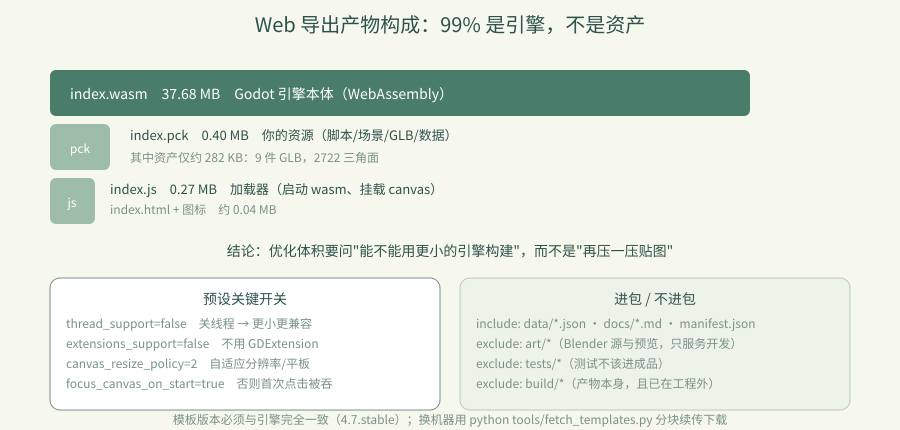

# 卷 5 · 第 25 章　Web 导出：预设、模板与 37.7 MB 是怎么来的

> **本章目标**：读懂 `export_presets.cfg` 的 Web 预设，知道产物里
> **谁占了多少**、以及"关线程 / 关扩展"这些开关为什么必须这么设。
>
> 对应任务：T25 / T26　|　对应文件：`project/export_presets.cfg`、`tools/dev.py`

---

## 25.1 一条命令与四个产物

```powershell
python tools/dev.py export-web      # → build/
```

| 文件 | 大小 | 是什么 |
|---|---:|---|
| `index.wasm` | **37.68 MB** | Godot 引擎本体（WebAssembly 编译产物） |
| `index.pck` | 0.40 MB | 你的游戏资源包（脚本/场景/GLB/数据） |
| `index.js` | 0.27 MB | 加载器（启动 wasm、挂载 canvas） |
| `index.html` + 图标 | ~0.04 MB | 页面外壳 |

**结论先说**：包体里 **99% 是引擎，不是你的资产**。
所以"优化体积"的第一性问题永远是：**能不能用更小的引擎构建**，而不是"再压一压贴图"。

---

## 25.2 预设里的关键开关

```
[preset.0.options]
variant/extensions_support=false          # 关 GDExtension
variant/thread_support=false              # 关线程
vram_texture_compression/for_desktop=true
html/canvas_resize_policy=2               # 自适应
html/focus_canvas_on_start=true           # 启动即获得焦点（否则要点一下才能操作）
html/head_include="<meta name=\"theme-color\" content=\"#d9ece6\" />"
progressive_web_app/enabled=false
```

| 开关 | 为什么 |
|---|---|
| `thread_support=false` | 关线程 → **体积更小、兼容性更好**；本游戏是单线程模型，不需要 |
| `extensions_support=false` | 不用 GDExtension → 省体积 |
| `canvas_resize_policy=2` | canvas 跟随窗口，适配不同分辨率与平板 |
| `focus_canvas_on_start` | 否则玩家打开页面后第一次点击会被浏览器吞掉 |
| `head_include` 的 theme-color | 移动端浏览器地址栏配色与游戏一致 |

> 📌 `focus_canvas_on_start` 是很典型的一类"**不影响功能但毁体验**"的开关——
> 少了它，新手会以为游戏卡住了。

---

## 25.3 过滤：什么进包，什么不进

```
include_filter="data/*.json,docs/*.md,assets/models/manifest.json"
exclude_filter="art/*,tests/*,build/*"
```

| 目录 | 是否进包 | 原因 |
|---|---|---|
| `assets/models/*.glb` | ✅ | 运行时资源（默认 all_resources 已含） |
| `assets/models/manifest.json` | ✅ 显式 include | 运行时要读 bounds（第 16 章） |
| `data/*.json` | ✅ 显式 include | palette / objectives / achievements |
| `art/*` | ❌ exclude | Blender 源、预览、溯源——**只服务开发** |
| `tests/*` | ❌ exclude | 测试脚本不该进成品 |
| `build/*` | ❌ exclude | 导出产物本身（且它已在工程外） |

> 📌 第 04 章"导出目录必须在工程外"的意义在这里闭合：
> 如果不排除，导出会把上一版的产物**再打进新包里**，包体越导越大。

---

## 25.4 模板：版本必须对齐

```
%APPDATA%\Godot\export_templates\4.7.stable\
```

- 模板版本必须**与引擎版本完全一致**（`4.7.stable` ↔ Godot 4.7.stable）
- 缺失时导出会直接失败
- 换机器用 `python tools/fetch_templates.py` 分块续传下载（约 1.28 GB）

---

## 25.5 体积优化的方向（按性价比排序）

| 方向 | 收益 | 成本 |
|---|---|---|
| **自定义构建（去掉不用模块）** | **最大**（可降到十几 MB） | 需自行编译引擎模板 |
| 纹理压缩 / 资产分包 | 中 | 低 |
| 加载进度条 + 首屏 | 体验提升明显 | 低 |
| 删无用资源 | 小（我们的资产才 282 KB） | 极低 |

> 📌 现状判断：**我们的资产只有约 0.4 MB**，优化资产是徒劳的。
> 真正的大头是引擎，所以要么接受 37 MB，要么走自定义构建（卷 5 第 28 章）。



---

### 🌩 在云端 agent（web-cb）里是什么样

| | 🖥 本地路线 | 🌩 云端 agent（web-cb） |
|---|---|---|
| 导出命令 | `dev.py export-web` | 同（平台执行同一命令） |
| 模板 | 本地 `%APPDATA%` | 云端镜像需**同版本模板**（4.7.stable） |
| 预览 | 本地 `http.server` | 云端预览（**WebGL 2，等于学员真实环境**） |
| 验收 | 本地 Chromium | 云端跑 `browser_smoke.py` 的 23 项 |
| 体积关注 | 本地看 | **云端更要关注**：学员是在浏览器里下载 37 MB |

> 🌩 云端最容易忽略的一点：**首屏等待**。37 MB 在云端内网很快，
> 但学员的网络可能很慢——加载进度条不是锦上添花，是必需。

---

## 25.6 常见坑速查（本章）

| 现象 | 原因 | 处理 |
|---|---|---|
| 导出报缺模板 | 模板版本不匹配 | 装同版本模板 |
| 打开页面点了没反应 | 没开 `focus_canvas_on_start` | 打开它 |
| 包体越导越大 | 产物在工程内没排除 | `exclude_filter` + 产物放工程外 |
| 运行时缺 manifest | 没 include 它 | 加进 `include_filter` |
| 手机上地址栏配色突兀 | 没设 theme-color | `head_include` |
| 移动端模糊 | canvas resize 策略不对 | `canvas_resize_policy=2` |

---

## 25.7 本章作业

1. 列出四个产物及大小，指出体积大头是什么，并说明优化优先级
2. 解释 `thread_support=false` 与 `focus_canvas_on_start` 各自解决了什么问题
3. 说明 `exclude_filter` 里三项各自的理由，并解释"产物放工程外"与它的关系
4. 跑一次 `dev.py export-web`，记录产物大小，与本章数字对比（引擎版本不同会有差异）

---

## 🎓 教学提示（给教师 / 直播主）

- **概念锚点**：**先测量，再优化**。37 MB 里 99% 是引擎，别去压 0.4 MB 的资产。
- **课堂演示**：现场导出并列出产物大小，让学员猜比例（通常会猜错）。
- **高频误解**：学生以为"贴图太多导致包大"。用数据打破直觉。
- **讨论题**：37 MB 你能接受吗？什么情况下必须做自定义构建？
- **批改要点**：作业 1 必须指出"大头是引擎 wasm"。

---

## 📹 录屏分镜（9 分钟）

| 时间 | 画面 | 解说词要点 |
|---|---|---|
| 00:00–01:40 | 导出命令 + 产物大小列表 | "99% 是引擎。" |
| 01:40–03:30 | 预设关键开关逐条 | "关线程省体积，focus 决定手感。" |
| 03:30–05:00 | include/exclude 过滤 | "开发资产不进包。" |
| 05:00–06:30 | 模板版本对齐 + fetch_templates | |
| 06:30–09:00 | 优化方向排序 + 作业 | |

## 🖼 配图清单

| 文件名 | 内容 | 生成方式 |
|---|---|---|
| `25-web-running.png` | 浏览器中运行的 Web 导出 | `python tools/course_capture.py --chapter 25` |
| `25-desktop-full.png` | 桌面视口完整画面 | 同上 |

## 🎥 直播脚本（L3 片段，10 分钟）

- **开场**："猜猜这个游戏的资产占包体多少？"——答案 1%
- **演示**：导出 + 列大小 + 打开页面
- **互动**：让观众报自己项目的包体构成
- **收尾**：预告 Windows 单文件

## ❓ 本章 FAQ

**Q：37 MB 一定要下载完才能玩吗？**
A：是（当前未做流式加载）。所以加载进度条与首屏提示很重要。

**Q：能不能把 pck 单独托管、按需加载？**
A：可以（Godot 支持外部 pck 加载），是"资产分包"方向，属于体积优化专项（第 28 章）。

**Q：为什么 index.pck 只有 0.4 MB？**
A：因为资产是低模 + 纯色材质（约 282 KB GLB），没有贴图和音频——第 17/18 章的风格决策在这里变现。
