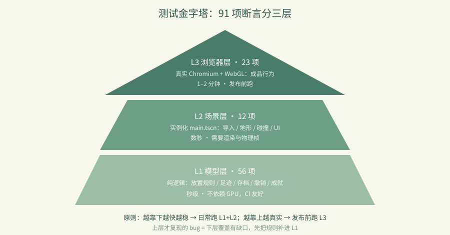

# 卷 6 · 第 29 章　三层验收：91 项断言是怎么分层的

> **本章目标**：理解本实训的**测试金字塔**——哪一层测什么、跑多快、
> 为什么这样分层能让"加一个资产"不再心惊胆战。
>
> 对应任务：T42 / T46（自动化测试）　|　对应文件：`tools/dev.py`、`project/tests/`

---

## 14.1 三层，各有分工

| 层 | 命令 / 文件 | 断言数 | 耗时 | 测什么 |
|---|---|---|---|---|
| **L1 模型层** | `tests/test_world.gd` | **56** | 秒级 | 纯逻辑：放置规则、足迹、存档、撤销、成就进度 |
| **L2 场景层** | `tests/smoke_scene.gd` | **12** | 数秒 | 真实例化 `main.tscn`：导入、地形、碰撞、UI 操作 |
| **L3 浏览器层** | `tests/browser_smoke.py` | **23** | 1–2 分钟 | 真实 Chromium + WebGL：最终成品行为 |
| | | **合计 91** | | |

```powershell
python tools/dev.py test        # 跑 L1 + L2（68 项，快）
# L3 需要先导出并起服务：
python tools/dev.py export-web
python -m http.server 8184 --bind 127.0.0.1 --directory project/build
python project/tests/browser_smoke.py --base http://127.0.0.1:8184/index.html
```

---

## 14.2 L1 模型层：不渲染，所以极快

`test_world.gd` 直接 `extends SceneTree`，用 GDScript 跑逻辑断言：

```gdscript
func check(condition: bool, label: String) -> void:
	if condition:
		passed += 1
		print("PASS ", label)
	...
print("WORLD_TEST_RESULT passed=", passed, " failed=", failed)
quit(1 if failed else 0)
```

**关键**：`quit(1)` —— 非零退出码让 CI / `dev.py` 能判定失败。这是自动化能成立的前提。

覆盖内容：世界边界、支撑规则、多格足迹、占位冲突、地形生成、存档往返（save→load→一致）、
撤销/重做、统计数据、章节目标进度、成就进度计算……

> 📌 这一层**完全不依赖渲染**，所以在无 GPU 的机器、CI、云端容器里都能跑——这是它最大的价值。

---

## 14.3 L2 场景层：真跑一遍完整游戏

```gdscript
var scene: Node3D = load("res://main.tscn").instantiate()
root.add_child(scene)
await process_frame
await physics_frame            # ← 必须等物理帧，碰撞才可用
```

断言包括：`scenes.size()`（GLB 是否都导入成功）、`visible_faces > 0`（地形真的生成了）、
`ground_collision.shape != null`（碰撞存在）、放置→撤销→重做、昼夜、分类切换、帮助弹窗。

**为什么需要这一层**：L1 证明"模型对"，L2 证明"**接进游戏后还是对的**"——
导入失败、脚本报错、节点缺失，只有实例化才知道。

---

## 14.4 L3 浏览器层：只测"最终成品"

23 项：GLB 加载数、真实地形面数、画布点击放置、撤销/重做、旋转、分类、拆除、
昼夜、弹窗开关、右键旋转、滚轮缩放、**浏览器保存 → 刷新 → 世界还在**、
平板视口适配、**无浏览器/引擎错误**。

> 📌 L3 的价值在于**平台**：Web 的 `user://` 是 IndexedDB、没有本地文件系统、
> 渲染走 WebGL——这些差异只有真浏览器能暴露（第 13 章的"存档顺序"就是这么发现的）。



---

## 14.5 分层的三条原则

1. **越靠下越快、越不依赖环境** → 日常改代码只跑 L1+L2（几十秒）
2. **越靠上越接近真实** → 发布前才跑 L3
3. **上层失败时，先补下层断言** → 一个只在 L3 复现的 bug，说明 L1/L2 少了覆盖

---

### 🌩 在云端 agent（web-cb）里是什么样

| | 🖥 本地路线 | 🌩 云端 agent（web-cb） |
|---|---|---|
| L1 模型层 | `dev.py test` | **完全一致**，云端容器无 GPU 也能跑 → 云端 CI 的主力 |
| L2 场景层 | 需要渲染/物理帧 | 云端同样可跑（dummy 驱动足够），但**注意缩略图会回退手绘**（第 13 章） |
| L3 浏览器层 | 本地 Chromium | 云端预览 + Playwright，最贴近学员真实环境 |
| 建议节奏 | 每次提交 L1+L2 | **云端把 L1+L2 做成提交门禁**，L3 定时或发布前跑 |

> 🌩 云端最大的优势：**L1 层零依赖**，意味着 CI 不需要 GPU 机器，成本极低。

---

## 14.6 常见坑速查（本章）

| 现象 | 原因 | 处理 |
|---|---|---|
| 测试失败但退出码 0 | 忘了 `quit(1)` | 用退出码判定，别靠看日志 |
| L2 里碰撞取不到 | 没等 `physics_frame` | 至少等 1–2 个物理帧 |
| L1 在无 GPU 机器上失败 | 误用了渲染相关 API | 保持 L1 纯逻辑 |
| 只在 L3 复现的 bug | 下层覆盖不足 | 把规则补进 L1 |
| 新增资产后 L1 挂了 | 断言写死了数量 | 见第 31 章 |

---

## 14.7 本章作业

1. 说出三层的断言数与各自的分工，解释为什么 L1 不依赖渲染很重要
2. 跑一次 `python tools/dev.py test`，从输出里找出 `WORLD_TEST_RESULT` 与 `SCENE_SMOKE_RESULT`，记录数字
3. 在 `test_world.gd` 里加一条断言（例如"在 y=25 放置应失败"），确认失败时退出码为 1
4. 思考：你所在项目如果要引入这套分层，最先该补的是哪一层？为什么？

---

## 🎓 教学提示（给教师 / 直播主）

- **概念锚点**：**测试金字塔**——下层多、快、稳；上层少、慢、真。
- **课堂演示**：故意改坏 `can_place()` 的一条规则，看三层各自在哪一步报错。
- **高频误解**：学生想把所有断言都放进浏览器层。讨论：反馈周期 vs 真实性。
- **讨论题**：如果一个 bug 只在 L3 复现，说明什么？（答：下层覆盖有缺口）
- **批改要点**：作业 3 必须验证退出码，不只是看打印。

---

## 📹 录屏分镜（9 分钟）

| 时间 | 画面 | 解说词要点 |
|---|---|---|
| 00:00–01:30 | 金字塔图 + 三层对照表 | "91 项，分三层。" |
| 01:30–03:00 | 跑 dev.py test，看 56 + 12 | "秒级反馈，无 GPU 也能跑。" |
| 03:00–04:30 | L2 里等物理帧的那两行 | "实例化之后，才叫接进了游戏。" |
| 04:30–06:30 | L3 列表 + 刷新持久化那一项 | "只有真浏览器才知道 IndexedDB 的脾气。" |
| 06:30–09:00 | 三条原则 + 作业 | |

## 🖼 配图清单

| 文件名 | 内容 | 生成方式 |
|---|---|---|
| `29-game-running.png` | 游戏运行画面（L3 的被测对象） | `python tools/course_capture.py --chapter 29` |
| `29-progress-panel.png` | 任务进度面板（L2/L3 都会断言的部分） | 同上 |

## 🎥 直播脚本（L3 片段，10 分钟）

- **开场**："你有几成把握改一行代码不会弄坏游戏？"——引入测试覆盖率话题
- **演示**：改坏规则 → 三层报错的先后顺序（现场计时）
- **互动**：让观众说出自己项目的"测试金字塔"长什么样
- **收尾**：预告浏览器验收细节

## ❓ 本章 FAQ

**Q：为什么 L1 和 L2 都是 GDScript 而不是 Python？**
A：它们测的是 GDScript 逻辑，用同一种语言最直接；`dev.py` 只负责调用 Godot 并检查退出码。

**Q：91 项算多吗？**
A：对一个可玩的 3D 建造原型来说，这个量级刚好覆盖"规则 + 集成 + 平台"三件事，不追求覆盖率数字。

**Q：能不能把 L3 也放进每次提交？**
A：可以但慢（1–2 分钟）。建议提交跑 L1+L2，L3 在发布前或定时跑。
